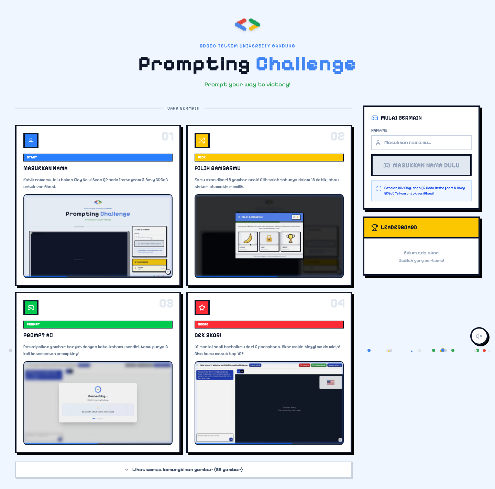

# GDGoC Prompting Challenge 🎮

A project for the Google Developer Groups On Campus (GDGoC) prompt challenge, specially themed around **Retro Pixel Art** and designed for **Telkom University** students! 

This React application is an AI-powered image recreation game where players compete to generate the most accurate image based on prompts and beat previous high scores. 

## Features ✨
- **Retro Pixel Art Aesthetic:** Enjoy a fun, interactive UI featuring falling pixels, 3D blocky text, and arcade-style transitions!
- **Background Music (BGM):** Immersive 8-bit style background music to keep you in the zone.
- **Leaderboard System:** Compete on the player leaderboard and aim for the top score!

## How to Play 🕹️

1. **Select a Picture**: Choose from available retro-themed reference images to recreate.
2. **Enter Details**: Provide your username to join the challenge.
3. **Prompt it!**: Write a prompt that guides the AI to generate an image as close as possible to the original reference.
4. **Beat the Score**: Your generated image will be scored based on similarity. Aim for 100/100 and climb the leaderboards!

## Setup 🚀

1. **Clone & Install**
```bash
git clone <your-repository-url>
cd gdgoc-prompt-challenge
npm install
```

2. **Add `.env.local`**
```env
# Required
E2B_API_KEY=your_e2b_api_key  # Get from https://e2b.dev (Sandboxes)
FIRECRAWL_API_KEY=your_firecrawl_api_key  # Get from https://firecrawl.dev (Web scraping)

# Optional (need at least one AI provider)
ANTHROPIC_API_KEY=your_anthropic_api_key  # Get from https://console.anthropic.com
OPENAI_API_KEY=your_openai_api_key  # Get from https://platform.openai.com (GPT-5)
GEMINI_API_KEY=your_gemini_api_key  # Get from https://aistudio.google.com/app/apikey
GROQ_API_KEY=your_groq_api_key  # Get from https://console.groq.com (Fast inference - Kimi K2 recommended)
```

3. **Run**
```bash
npm run dev
```

Open [http://localhost:3000](http://localhost:3000) in your browser.

## License

MIT
